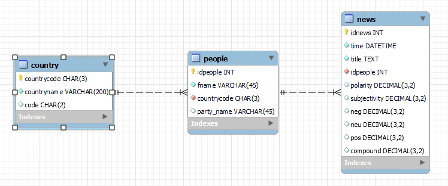
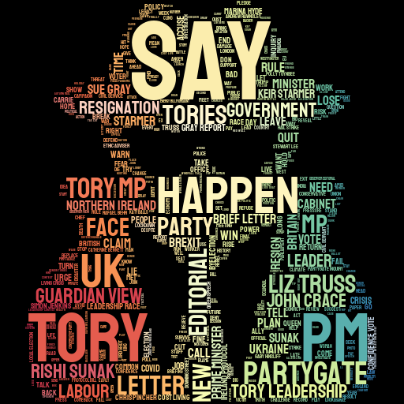
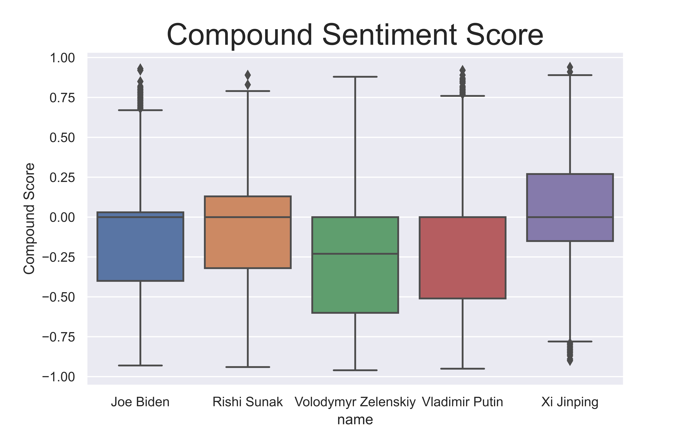

# Sentiment Analysis of the Newspaper The Guardian

## Basic Information:
- Author: Sergi Portolés
- Project IV: for the Data Analytics Bootcamp in Ironhack (Sentiment Analysis API)

## Objectives of the Project:

This project has two main objectives

1) Create a complete RestfulAPI with Flask ready to be deployed.

2) Test if Sentiment analysis can be used to infer the Political alignment of a newspaper.

## Data Sources Used:

| Source   |      Type      |  Data extracted  |
|----------|:-------------:|------:|
| [The Guardian](https://open-platform.theguardian.com/)| API | API of News published in the newspaper |

## Python Libraries Used:
 
| Library   |      Use     |
|----------|:-------------:|
| Pandas | Data Frame manipulation |
| Requests | HTTP Calls |
| Datetime | Classes for manipulating dates and times |
| Urllib | Url encode |
| dotenv | Import tokens |
| Os | Set paths |
| Tqdm | Show progress bar |
| Unidecode | Transform strings to Unicode |
| Sqlalchemy | Connect with MySQL |
| Re | Regex's queries|
| Stylecloud | Generates Wordclouds |
| IPython | Visualize image |
| Matplotlib | Data visualization |
| Seaborn | Data visualization |
| TextBlob | Sentiment Analysis |
| NLTK | Natural Language Toolkit |
| Spacy | Natural Language Processing |

## File Structure:

### *main.py*

Python file that establishes the Flask local development server and the API endpoints

### *api-use-example.ipynb*

Jupyter notebook with examples of how to use this API and generate figures.

### ./src/

- ***queries.py*** &rarr; Functions to query The Guardian API
- ***sentiment.py*** &rarr; Functions to calculate the sentiment score.
- ***queries.py*** &rarr; Functions to generate a Worldcloud figure.
- ***score.py***  &rarr; Functions to generate figures with the sentiment scores

### ./data/

.sql files necessary to build the database structure

### ./tools/sql_queries.py

Functions to retrieve the data from the database and populate it with new instances.

### ./config/sql_queries.py

Establishes the engine to connect with the SQL database

### ./img/

Folder to store all the figures generated

## How to use this repository

### Requirements:

1) Python version 3.9 (might work in older versions)
2) MySQL (might work with other SQL database management systems)
3) Python libraries specified before

### Initial Configuration:

1) Obtain an API token from [The Guardian Website](https://open-platform.theguardian.com/)
2) Create a .env file in the main folder of this repository with this structure:

```txt
THE_GUARDIAN = <API token>
SQL = <MySQL PASSWORD>
```
3) Execute the main.py in the console:
```console
python main.py
```
4) Start sending requests to the API. [Click here for Full documentation](https://rawcdn.githack.com/sborto86/project-IV-sentiment-analysis-api/3fee6b4dfc2df19577d4d91acb4fe266feb3bcb5/api-doc.html)

## Database

The SQL database schema and tables are created automatically upon the first request.

Alternatively, fulldatabase.sql file can be executed in MySQL to create the database

### SQL database schema



## Results Summary

### Initial considerations

1) The following relevant political figures were used to perform this analysis: Liz Truss, Boris Johnson, Rishi Sunak, Keir Starmer, Angela Rayner, King Charles III, Queen Elisabeth II, Volodymyr Zelenskiy, Vladimir Putin, and Xi Jinping.

2)  The analysis was performed in a two-year window (starting November 2020) using the titles of the news published in The Guardian about each of the political figures mentioned before.

3) Only the most representative figures of the analysis have been included in this file, all the figures generated can be found in the [jupyter file](./api-use-example.ipynb) and in the *img/* folder

### Individual Analysis

For each relevant political figure a WordCloud and a Sentiment Score figure were generated, all the figures can be found in the [jupyter file](./api-use-example.ipynb) and in the *img/* folder

Here are some examples:

#### Queen Elisabeth II Wordcloud


#### Boris Johnson Wordcloud



#### Queen Elsiabeth II Sentiment


### UK Presidents Comparison


#### Conclusions:

1) There seem to be no significant differences in the sentiment score between the last 3 UK presidents. 

2) Liz Truss was relatively irrelevant in the newspaper before November 2021

### Labour vs Conservative Parties


#### Conclusions

1) There is a slightly higher compound sentiment score in the news about Labour Party leaders.

2) Lower sentiment scores would be expected for the parties in the opposition. However, the contrary was observed in that case.

### King Charles III vs Queen Elisabeth II


#### Conclusions

1) It seems that Queen Elisabeth II has a slightly better compound sentiment score over time than King Charles III.

2) The compound sentiment score decreased abruptly during the last 2 months of the analysis, especially for Queen Elisabeth. This is probably related to the news about her death and funeral as shown in the Wordcloud which is considered a negative sentiment score.

### Joe Biden vs Donald Trump


#### Conclusions

1) As expected Joe Biden has a slightly better compound sentiment score over time than Donald Trump

2) Considering the political style of Donald Trump the sentiment score is surprisingly close to Joe Biden's with a profile more institutional

### World Leaders




#### Conclusions:

1) Volodymyr Zelensky was almost inexistent in the news until the end of 2021
when the tensions with Russia start to escalate

2) Volodymyr Zelensky and Vladimir Putin both have similar negative scores probably due to war news normally being classified as negative sentiment.

3) Joe Biden has a relatively low compound sentiment score compared to other leaders.

4) Surprisingly the leader with a better compound sentiment score over the last 2 years is Xi Jinping. It seems that the biggest difference is observed in the first half of 2021 and might be related to how China implemented effective control of the Covid-19 pandemic.


 ## Final Conclusions:

1) NLTK compound score seems to work better than TextBlob polarity score

2) As expected for a renowned newspaper such as The Guardian, the overall neutral sentiment score is high and the subjectivity sentiment score is low.

3) The small differences in sentiment scores observed when comparing the leaders from different parties are consistent with the known political alignment of the newspaper (Center-left).

4) It seems that sentiment analysis might be useful to infer the political alignment of a source of news.

## Next Steps:

1) Adding statistical analysis
2) Try to find a better sentiment analysis package
3) Improve plotting functions to get more appealing and informative figures.
4) Improve endpoints and data validation.
5) Improve response error messages and codes
6) Test a more biased source of news


